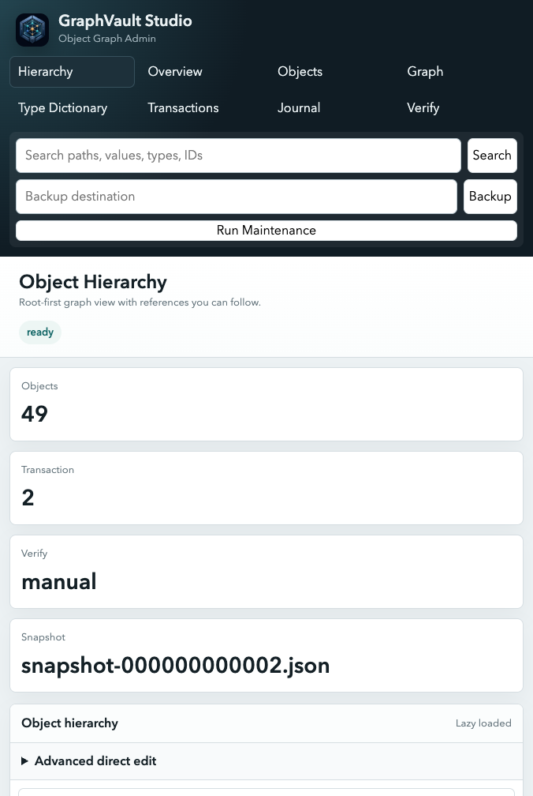

# GraphVault Studio

[](https://github.com/Sprengmeister-dev/graphvault-studio/actions/workflows/ci.yml)


GraphVault Studio is the graphical admin client for [GraphVault](https://github.com/Sprengmeister-dev/graphvault-library) stores. It lets you inspect, search, verify, maintain, back up, and carefully edit object graph data without pretending the store is a table database.



## Why Not Just Use A Normal Database Admin Tool?

Database admin tools are great when your data is records, rows, documents, or key-value entries. GraphVault stores a live object graph: a root object, nested structures, references, shared children, multiple parents, class metadata, transactions, manifests, and object records. A normal SQL or document browser cannot show that shape honestly.

Studio is useful when you need to answer questions like:

- what object is this reference pointing to?
- how do I get from this object back to the root?
- which parents directly reference this object?
- what did the latest transaction write?
- does the store verify cleanly?
- can I make a small controlled data correction without hand-writing field paths and JSON?

It is deliberately generic. It does not assume customers, orders, tickets, CMS pages, or any other application domain. It works with object paths, values, types, references, transactions, and graph relationships.

## Features

- root-first hierarchy browser
- search across encoded paths and values
- parent path lookup from object to root
- support for objects with multiple direct parents
- paged object browser for large stores
- graph edge view
- GVQL query console for graph queries and batch-update previews
- editable primitive fields with preview and confirmation-token safety
- verification, maintenance, backup, transaction and journal views
- optional bearer-token protection
- zero frontend build step; the UI is embedded in the TypeScript package

## Install

From GitHub today:

```bash
npm install github:Sprengmeister-dev/graphvault-studio
```

Or pin the package name locally with an npm alias:

```bash
npm install graphvault-studio@github:Sprengmeister-dev/graphvault-studio
```

Once published to the npm registry:

```bash
npm install graphvault-studio
```

The npm name `graphvault-studio` is currently available. Publishing requires an npm login on the local machine.

## Run

### File-Based Store

The CLI reads a local GraphVault storage directory. This is the common setup for a service, desktop app, or local development environment.

```bash
npx graphvault-studio --dir ./data --port 4177
```

Mutation APIs are opt-in:

```bash
npx graphvault-studio \
  --dir ./data \
  --port 4177 \
  --allow-mutations \
  --confirm-token confirm
```

Optional auth:

```bash
GRAPHVAULT_ADMIN_TOKEN=secret npx graphvault-studio --dir ./data
```

Then open:

```text
http://127.0.0.1:4177
```

### Remote Or Custom Storage

For remote storage, start Studio programmatically and pass the same `storageTarget` adapter your app uses. `storageDirectory` is still required; for remote targets it acts as the key prefix or logical root path inside the target.

```ts
import { S3StorageTarget } from "graphvault";
import { startAdminServer } from "graphvault-studio";

await startAdminServer({
  storageDirectory: "prod/app-store",
  storageTarget: new S3StorageTarget({
    bucket: "graphvault-prod",
    prefix: "stores",
    client: s3ClientAdapter,
  }),
  port: 4177,
  authToken: process.env.GRAPHVAULT_ADMIN_TOKEN,
});
```

HTTP-backed storage works the same way:

```ts
import { HttpStorageTarget } from "graphvault";
import { startAdminServer } from "graphvault-studio";

await startAdminServer({
  storageDirectory: "main",
  storageTarget: new HttpStorageTarget({
    baseUrl: "https://storage.example.com/graphvault",
    headers: { authorization: `Bearer ${process.env.STORAGE_TOKEN}` },
  }),
  port: 4177,
});
```

SQL-backed storage uses an adapter around your database client:

```ts
import { SqlStorageTarget } from "graphvault";
import { startAdminServer } from "graphvault-studio";

await startAdminServer({
  storageDirectory: "main",
  storageTarget: new SqlStorageTarget({
    client: sqlClientAdapter,
    tableName: "graphvault_objects",
    lockTableName: "graphvault_locks",
  }),
  port: 4177,
});
```

For mutation endpoints, always set `allowMutations: true` and a `mutationConfirmToken`. For exposed or shared environments, also set `authToken`.

## GVQL

Studio includes a GVQL console for GraphVault stores. It supports read queries and safe batch-update previews:

```sql
MATCH (doc:Document)-[:owner]->(owner:Owner)
WHERE owner.name = "Platform Team"
RETURN doc.id AS id, doc.title AS title
ORDER BY doc.title ASC, doc.id ASC
LIMIT 25
OFFSET 0
```

```sql
MATCH (doc:Document)
RETURN DISTINCT doc.status AS status
ORDER BY status ASC
```

```sql
MATCH (doc:Document)
WHERE doc.status = "draft"
SET doc.status = "archived"
RETURN count(*) AS changed
```

Aggregate queries can be inspected directly in the same console:

```sql
MATCH (item)
RETURN item.status AS status, count(*) AS count
GROUP BY item.status
HAVING count > 1
ORDER BY count DESC, status ASC
```

`Run / Preview` executes read queries and dry-runs updates. `Commit GVQL` applies update statements only when Studio was started with mutation support and the confirmation token matches.

Each GVQL run includes an execution-plan row that shows whether Studio used a type index, primitive-property index, or full scan, plus candidate and returned-row counts. That makes slow queries much easier to tune before they become production habits.
Use `LIMIT` and `OFFSET` in the console for predictable paging through large result sets. `RETURN DISTINCT` is useful when you want a compact list of values such as statuses, tenants, regions, or object categories.

## Relationship To GraphVault Library

The storage engine lives in [graphvault-library](https://github.com/Sprengmeister-dev/graphvault-library). Studio is intentionally separate so applications can depend on the lightweight persistence library without bundling an admin UI.

## Developer Notes

- Studio is a pure TypeScript package with no frontend build toolchain.
- The UI is served from the embedded admin server, so `npx graphvault-studio --dir ./data` is enough to inspect a store.
- The package depends on GraphVault Library for storage layout, verification, parent index reading, and storage targets.
- Run `npm test` to type-check, emit `dist/`, create a real store, exercise the admin client, and verify the embedded HTTP API.
- CI runs on Node.js 20 and 22.
